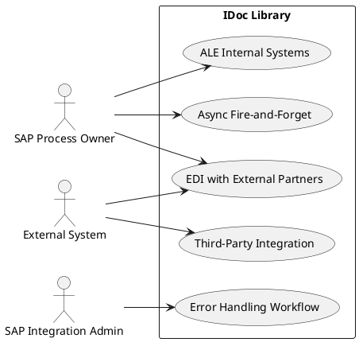
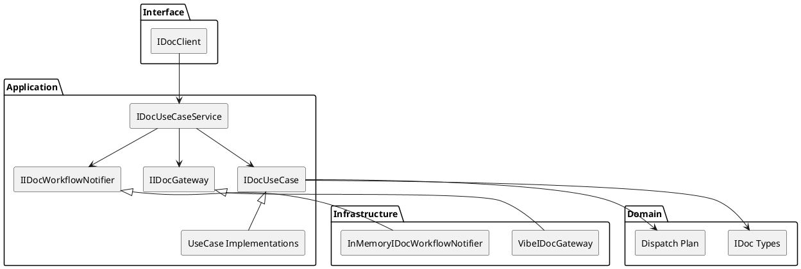
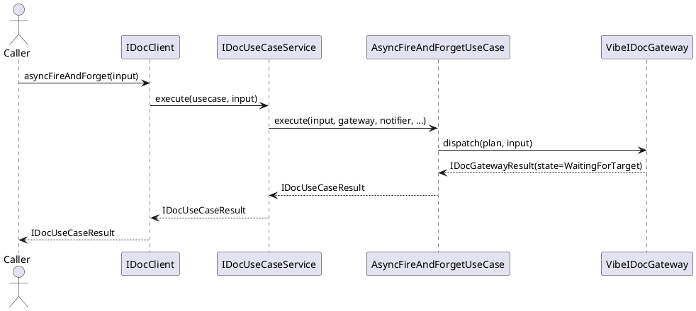
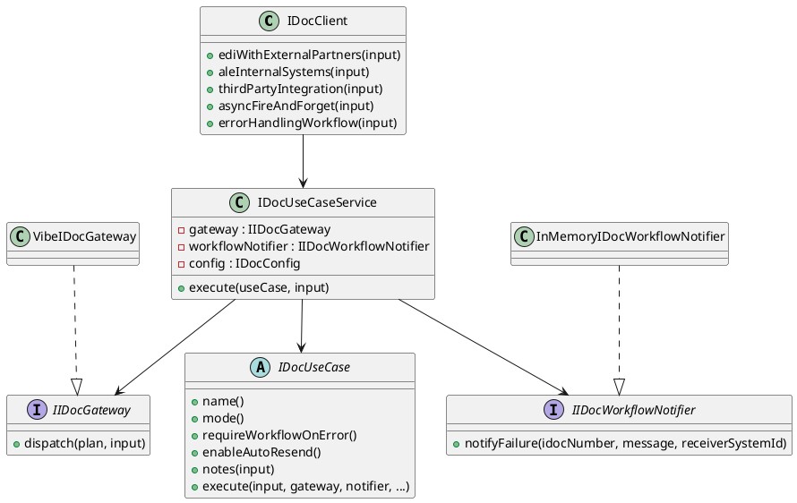

# IDoc Library UML Description

This document provides UML-style descriptions for the SAP IDoc library.

## 1. Use Case Diagram

## 2. Component Diagram (Clean Architecture)

## 3. Sequence Diagram (Example: Async Fire-and-Forget)

## 4. Class Diagram (Core Types)

## 5. Message Scenario Coverage

- ORDERS: automated procurement to vendors.
- INVOIC: inbound invoice posting.
- DESADV: advanced shipping notifications.
- MATMAS and ACC_DOCUMENT: ALE master and finance replication.
- DELVRY, PRODORD, CUSDEC: third-party logistics and manufacturing integration.
