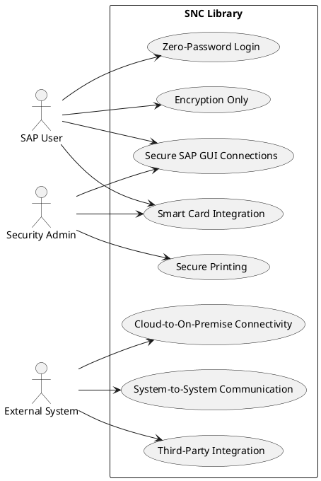
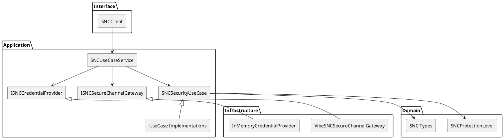
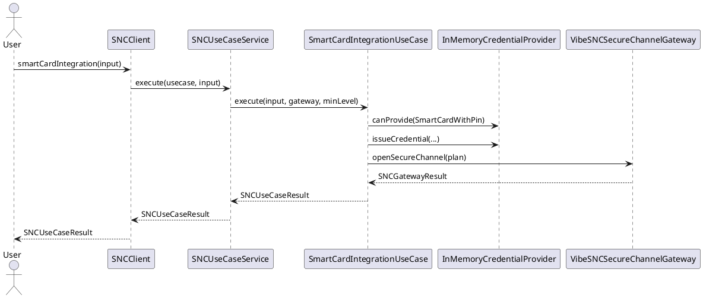
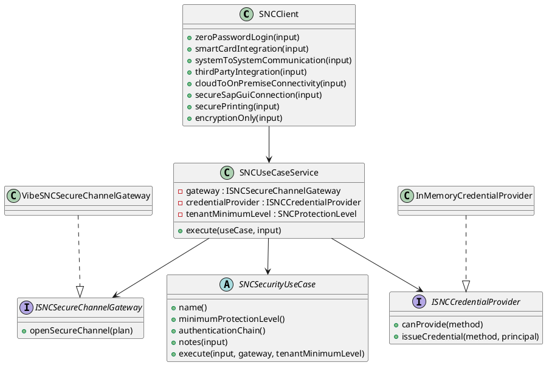

# SNC Library UML Description

This document provides UML-style descriptions for the SAP SNC library.

## 1. Use Case Diagram

## 2. Component Diagram (Clean Architecture)

## 3. Sequence Diagram (Example: Smart Card Integration)

## 4. Class Diagram (Core Types)

## 5. Protection Level Mapping

- AuthenticationOnly: verifies identities.
- IntegrityProtection: verifies identities and detects tampering.
- PrivacyProtection: encryption plus integrity plus authentication.
